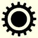

__Warning! Project is under heavy development and is in the alpha stage!__

# rein

Minimalist engine for 2d games & demos. Little brother of [reinstead](https://github.com/instead-hub/reinstead) whitch
in turn is the brother of the [INSTEAD](https://github.com/instead-hub/instead).

# Build

Deps: SDL2, luajit.
```
$ make
$ ./rein demo/demo.lua
```
See ./make.sh if any problems.

# Downloads

[Continuous builds](https://github.com/gl00my/rein/releases/download/continuous/rein.zip)

# Doc

[doc/api-ru.md](doc/api-ru.md)

# Contacts

- Join the irc channel #rein on irc.oftc.net;
- TODO.
